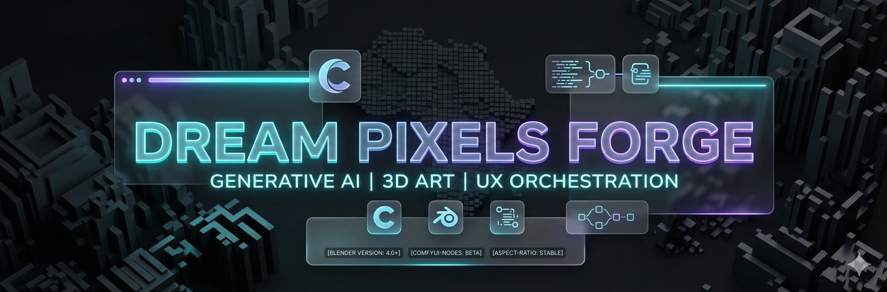
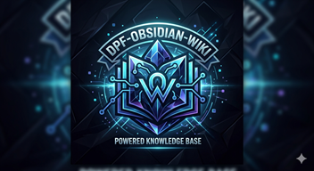

# 🌌 Dream Pixels Forge

Exploring the intersection of Human Creativity and Machine Intelligence.

## 💡 The Journey

I believe that technology is at its best when it acts as an invisible bridge between an idea and its realization. My work is a continuous exploration of how AI and 3D can empower creators to push the boundaries of their imagination.

I'm currently focused on crafting tools that make complex workflows feel like magic—blending the precision of Blender with the raw power of generative AI.

## 🛠️ Community Projects

These are open tools built for artists and developers to explore together. If you find them useful, leaving a ⭐ on the repository is the best way to support my work!

### Last Projects

1. <https://github.com/Dream-Pixels-Forge/brandly>
2. <https://github.com/Dream-Pixels-Forge/artisan_labs_dev>
3. <https://github.com/Dream-Pixels-Forge/universal-blender-mcp>
4. <https://github.com/Dream-Pixels-Forge/prides>
5. <https://github.com/Dream-Pixels-Forge/vanguard-wooden-uikit>

### Project Showcase

Current project snapshots are shown below. The displayed image has been updated to the latest project version.

  <figure style="width:280px; margin:0;">
    
    <figcaption style="margin-top:0.75rem; font-size:0.95rem; line-height:1.4;">
      <strong>dpf-obsidian-wiki</strong> 
      Updated project preview click to view the project· <a href="https://github.com/Dream-Pixels-Forge/dpf-obsidian-wiki">GitHub</a>
    </figcaption>
  </figure>

| Project | Goal | Status | GitHub |
| --- | --- | --- | --- |
| Aspect-Ratio | Simplify framing for digital artists. | Stable | [GitHub](https://github.com/Dream-Pixels-Forge/Aspect-Ratio) |
| Photographer-Alpha7-Nodes | Bring cinematic physics to AI generations. | Beta | [GitHub](https://github.com/Dream-Pixels-Forge/Photographer-Alpha7-Nodes) |
| Mzikart-Singer | Experiments in AI-driven vocal expression. | Active | [GitHub](https://github.com/Dream-Pixels-Forge/Mzikart-Singer) |

## 🧪 Experiments & Learning

My daily "Forge" consists of playing with:

- Generative systems: ComfyUI, Stable Diffusion, and LLM orchestration.
- Visual aesthetics: mastering glassmorphism and intuitive UI/UX.
- Global tech: driven by the dream of seeing the DRC's creative tech scene shine on the world stage.

## 🤝 Let's Build Together

Inspiration is a two-way street. If you find value in my tools, feel free to star the projects you like or reach out to collaborate on the next frontier of creative tech.

> "The best way to predict the future is to forge it—together."

## 📫 Connect

Stay updated with my latest experiments and creations:

Maintained with ☕ and passion by Dream Pixels Forge.
