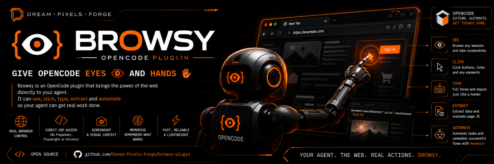

<div align="center">
  
  <h1>browsy</h1>
  <p><strong>Zero-Middleware CDP Browser Automation for OpenCode</strong></p>
  <p>Navigate, screenshot, and evaluate page JS in live Chrome/Chromium tabs via the Chrome DevTools Protocol — no Puppeteer, no Playwright, no drivers. Auto-discovers page targets and learns selectors, quirks, and flows across sessions via <a href="https://github.com/Dream-Pixels-Forge/memorius">memorius</a>.</p>
  <p>
    <a href="https://github.com/Dream-Pixels-Forge/browsy-plugin">Standalone repo</a> ·
    <a href="https://opencode.ai/docs/plugins/">Plugin docs</a> ·
    <a href="https://opencode.ai/docs/skills/">Skill docs</a> ·
    <a href="#install-as-an-opencode-plugin">Install</a>
  </p>
  <hr />
</div>

> **OpenCode plugin** — registers `browsy_*` custom tools and an [agent skill](https://opencode.ai/docs/skills/). See [Install as an OpenCode plugin](#install-as-an-opencode-plugin).

## Features

- **Zero middleware** – No ChromeDriver, Puppeteer, or Playwright. Direct CDP WebSocket.
- **Zero hidden state** – Every call receives an explicit `browserUrl` (and optional `targetId`).
- **Granular targeting** – Operate on specific tabs/windows via `targetId`, or auto-discover the first page target.
- **Protocol‑complete** – Full CDP domain wrappers (Page, Runtime, Performance, Accessibility).
- **OpenCode‑ready** – Plugin entry point with `browsy_navigate`, `browsy_screenshot`, `browsy_evaluate`, and `browsy_recall` custom tools.
- **Learns across sessions** – Optional memorius integration stores browser-automation learnings (selectors, page quirks, navigation flows) and surfaces them before future tasks.
- **Agent skill** – Bundled `browsy` skill auto-installs to `~/.config/opencode/skills/browsy/` so opencode's `skill` tool can discover it.

## Install as an OpenCode plugin

OpenCode auto-loads plugins from your config's `"plugin"` array at startup using Bun. There are three install paths:

### Path 1 — From npm (once published)

```json
{
  "$schema": "https://opencode.ai/config.json",
  "plugin": ["browsy-plugin"]
}
```

OpenCode runs `bun install` at startup and caches the package in `~/.cache/opencode/node_modules/`. The `main` field points to `src/plugin.ts` which Bun executes as TypeScript directly — **no build step required**.

### Path 2 — From GitHub (works now)

Bun resolves git specs, so you can install directly from GitHub before an npm publish:

```json
{
  "$schema": "https://opencode.ai/config.json",
  "plugin": ["github:Dream-Pixels-Forge/browsy-plugin"]
}
```

### Path 3 — Local plugin directory

Clone the repo into your plugins folder and OpenCode auto-loads it on startup:

```bash
# Global (all projects)
git clone https://github.com/Dream-Pixels-Forge/browsy-plugin.git \
  ~/.config/opencode/plugins/browsy-plugin

# Or project-level
git clone https://github.com/Dream-Pixels-Forge/browsy-plugin.git \
  .opencode/plugins/browsy-plugin
```

Local plugins are loaded directly — the dependencies in `package.json` are installed automatically by OpenCode at startup via `bun install`.

### Passing options

All three paths accept plugin options as a `[name, options]` tuple:

```json
{
  "$schema": "https://opencode.ai/config.json",
  "plugin": [
    ["github:Dream-Pixels-Forge/browsy-plugin", {
      "url": "ws://localhost:9222",
      "remember": true
    }]
  ]
}
```

Options:

| Option           | Env var            | Default               | Description                                                        |
| ---------------- | ------------------ | --------------------- | ------------------------------------------------------------------ |
| `url`            | `BROWSY_URL`       | `ws://localhost:9222` | Chrome DevTools WebSocket endpoint.                                |
| `targetId`       | `BROWSY_TARGET_ID` | _(none)_              | Default tab to operate on.                                         |
| `remember`       | `BROWSY_REMEMBER`  | `false`               | Store a learning to memorius after each successful browsy call.    |
| `memoriusVault`  | —                  | `main`                | Memorius vault name.                                               |
| `memoriusShelf`  | —                  | `browsy`              | Memorius shelf for browsy learnings.                               |
| `installSkill`   | —                  | `true`                | Auto-install the bundled `browsy` skill to the user's skills dir.  |

### Prerequisites

Launch Chrome with remote debugging before calling browsy tools:

```bash
chromium --remote-debugging-port=9222 --headless --no-sandbox
```

The default endpoint is `ws://localhost:9222`. Override with the plugin's `"url"` option or the `BROWSY_URL` environment variable.

### Registered tools

Once loaded, the agent has access to these custom tools:

| Tool                | Description                                                              |
| ------------------- | ------------------------------------------------------------------------ |
| `browsy_navigate`   | Navigate a CDP-connected tab to a URL.                                    |
| `browsy_screenshot` | Capture a screenshot; returns base64 PNG or writes to `outputPath`.      |
| `browsy_evaluate`   | Evaluate a JavaScript expression in the page context.                    |
| `browsy_recall`     | Search past browser-automation learnings from the memorius vault.        |

### Memorius learning

When `"remember": true` (or `BROWSY_REMEMBER=1`), every successful `browsy_*`
tool call stores a compact learning to memorius under the `"browsy"` shelf.
Use the `browsy_recall` tool before a browser task to surface relevant past
learnings (selectors that worked, page-specific quirks, navigation flows).

Memorius is **optional** — if the `memorius` CLI is not installed, browsy
works normally and `browsy_recall` returns an empty result. To enable native
memorius agent tools as well, add it as an [MCP server](https://opencode.ai/docs/mcp-servers/):

```json
{
  "mcp": {
    "memorius": { "type": "local", "command": ["memorius", "serve"] }
  }
}
```

### Agent skill

The plugin bundles a `browsy` agent skill (`skills/browsy/SKILL.md`). On
init, it is copied to `~/.config/opencode/skills/browsy/SKILL.md` so
opencode's `skill` tool can discover and load it. Disable this with
`"installSkill": false`.

## API (standalone library)

```ts
import { createBrowsy } from "browsy-plugin";

// Create a Browsy instance
const browsy = createBrowsy("ws://localhost:9222");

await browsy.connect(); // Connect to Chrome DevTools Protocol
try {
  // Domains are available after connect() (they throw otherwise).
  await browsy.page.navigate({ url: "https://example.com" });
  const screenshot = await browsy.page.captureScreenshot({ format: "png" });
  const title = await browsy.runtime.evaluate({ expression: "document.title" });
} finally {
  await browsy.close(); // Always clean up
}
```

### `createBrowsy(browserUrl: string, targetId?: string): Browsy`

Factory function to create a Browsy instance.

### `Browsy` class

| Member          | Type                  | Description                                                                      |
| --------------- | --------------------- | -------------------------------------------------------------------------------- |
| `connect()`     | `Promise<void>`       | Opens a CDP WebSocket connection to `browserUrl`/`targetId` and initializes domains. |
| `close()`       | `Promise<void>`       | Closes the CDP connection.                                                       |
| `isConnected`   | `boolean`             | True if a live CDP connection exists.                                            |
| `getStatus()`   | `ConnectionStatus`    | Current connection state (`disconnected`, `connecting`, `connected`, `closed`). |
| `page`          | `PageDomain`          | Page‑related CDP commands (navigate, screenshot, reload, etc.). **Throws if not connected.** |
| `runtime`       | `RuntimeDomain`       | Runtime‑related CDP commands (evaluate, releaseObjectGroup). **Throws if not connected.**      |
| `performance`   | `PerformanceDomain`   | Performance‑related CDP commands (getMetrics, enable/disable). **Throws if not connected.**   |
| `accessibility` | `AccessibilityDomain` | Accessibility‑related CDP commands (getFullAXTree). **Throws if not connected.**               |

### Convenience Functions

For quick one‑off operations without managing a `Browsy` instance:

```ts
import { navigate, captureScreenshot, evaluate } from "browsy-plugin";

// Navigate
await navigate("ws://localhost:9222", "https://example.com");

// Screenshot (returns base64 PNG string)
const imgBase64 = await captureScreenshot("ws://localhost:9222", { format: "png" });

// Evaluate JavaScript (returnByValue: true by default)
const pageTitle = await evaluate("ws://localhost:9222", "document.title");
```

Each function automatically opens a temporary CDP connection, performs the operation, and closes it.

### URL resolution

`browserUrl` accepts `ws://`, `wss://`, `http://`, `https://`, or a bare `host:port`:

- `http(s)://` is converted to `ws(s)://`.
- When a `targetId` is given, the connection goes to `/devtools/page/<targetId>` (required for `Page` domain commands).
- Without a `targetId`, the connection defaults to `/devtools/browser`.

## CDP Domain Wrappers

Each domain exposes strongly‑typed methods matching the CDP specification.

### PageDomain

| Method                                                | Parameters                                                                                                                                                                 | Returns                                                                                          |
| ----------------------------------------------------- | -------------------------------------------------------------------------------------------------------------------------------------------------------------------------- | ----------------------------------------------------------------------------------------------- |
| `navigate(params)`                                    | `{ url: string; referrer?: string; transitionType?: string; frameId?: string }`                                                                                          | `{ frameId: string; loaderId: string; errorText?: string }`                                     |
| `captureScreenshot(params?)`                          | `{ format?: 'png'\|'jpeg'; quality?: number; clip?: {x,y,width,height,scale?}; fromSurface?: boolean }`                                                                   | `{ data: string }` (base64‑encoded image)                                                       |
| `reload(params?)`                                     | `{ hard?: boolean; ignoreCache?: boolean }`                                                                                                                                | `void`                                                                                          |
| `bringToFront()`                                      | —                                                                                                                                                                          | `void`                                                                                          |
| `getLayoutMetrics()`                                  | —                                                                                                                                                                          | `{ contentSize, visibleSize, layoutSize, visualViewport }`                                       |

### RuntimeDomain

| Method                      | Parameters                  | Returns                              |
| --------------------------- | --------------------------- | ------------------------------------ |
| `evaluate(params)`          | `Runtime.EvaluateParams`    | `Runtime.EvaluateResult`             |
| `releaseObjectGroup(params)`| `{ objectGroup: string }`   | `void`                               |

### PerformanceDomain

| Method         | Parameters | Returns                                            |
| -------------- | ---------- | -------------------------------------------------- |
| `enable()`     | —          | `void`                                             |
| `disable()`    | —          | `void`                                             |
| `getMetrics()` | —          | `{ metrics: Array<{ name: string; value: number }> }` |

### AccessibilityDomain

| Method            | Parameters | Returns                                         |
| ----------------- | ---------- | ----------------------------------------------- |
| `getFullAXTree()` | —          | `{ nodes: AXNode[] }` (full accessibility tree) |

## Development

### Prerequisites

- Node.js ≥ 18
- TypeScript
- A Chrome/Chromium instance launched with remote debugging:
  ```bash
  chromium --remote-debugging-port=9222 --headless --no-sandbox
  ```

### Build

```bash
npm run build     # compiles src/ to dist/ (ESM)
npm run typecheck # type-check without emitting
npm test         # run the vitest suite
```

### Run Example

```bash
npm run example
```

## How It Works

1. **Connection** – opens a raw WebSocket to the Chrome DevTools endpoint.
2. **Command Dispatch** – each method serializes a CDP message (`{id, method, params}`) and waits for the matching response via message ID correlation. Errors from CDP are **rejected**, not swallowed.
3. **Event Subscription** – domains can listen for CDP events via the internal event emitter.
4. **Resource Cleanup** – calling `close()` (or letting a convenience function scope end) tears down the WebSocket.

## Why “Zero Middleware”?

Traditional browser automation layers (Selenium/WebDriver, Puppeteer, Playwright) introduce extra binaries, separate processes, protocol translation layers, and hidden internal state. `browsy-plugin` bypasses all of that: you talk **directly** to Chrome’s debugging interface, giving you minimal latency, full fidelity to CDP, a deterministic resource lifecycle, and no additional attack surface.

## Use Cases in OpenCode

- **Live UI Validation** – Agents can open a DevTools tab, navigate, and assert visual/regression state.
- **Bug Reproduction** – From an issue URL, automatically open the page, fill forms, capture console errors.
- **Performance Budgets** – Collect metrics via `Performance.getMetrics()` before allowing a merge.
- **Documentation Generation** – Walk a wizard UI, capture screenshots per step, auto‑generate markdown guides.
- **Accessibility Auditing** – Pull the full AXTree and verify ARIA roles, names, and states.
- **Data Extraction** – Use `Runtime.evaluate` to pull structured data from rendered pages without fragile selectors.

## License

MIT © 2026 Dream-Pixels-Forge
